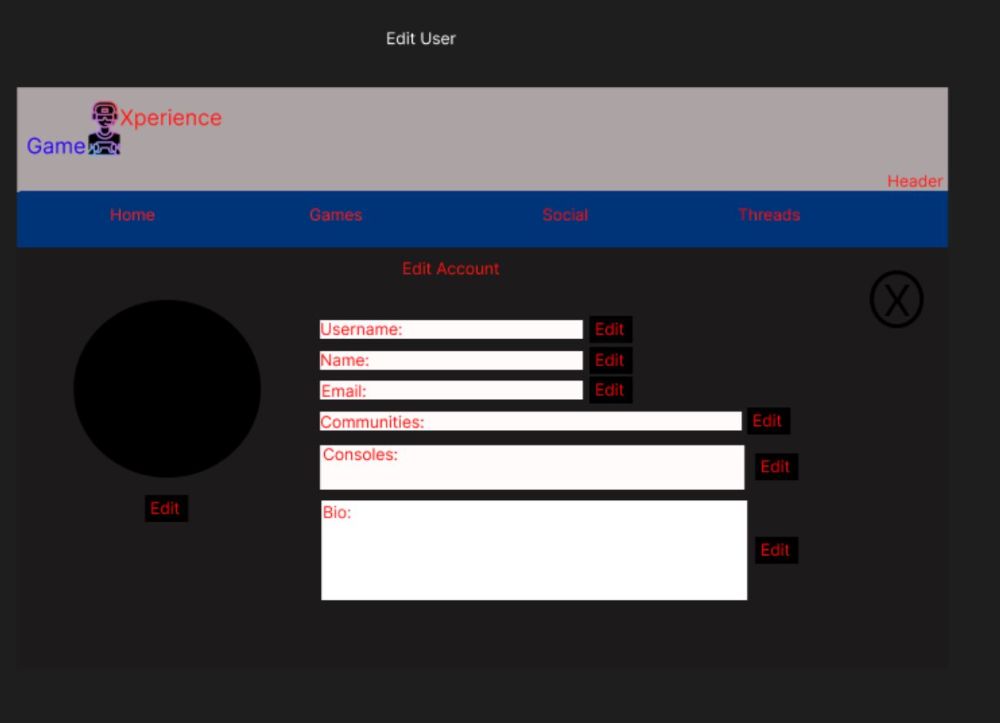

# GameXperience

GameXperience is an app that allows you to connect with fellow gamers to discuss game related topics.

## Wireframes

## React Tree

## Schema

## API Endpoints

| API Route            	| HTTP Verb 	| Purpose                                                       	| Deliverable 	|
|----------------------	|-----------	|---------------------------------------------------------------	|-------------	|
| /signup              	| POST      	| Create a new user                                             	| Core        	|
| /login               	| POST      	| Login to a user account                                       	| Core        	|
| /home                	| GET       	| Display Home Feed                                             	| Core        	|
| /users               	| GET       	| View all users on the app                                     	| Core        	|
| /users/id            	| GET       	| Display selected user profile                                 	| Core        	|
| /users/id            	| DELETE    	| Delete user profile                                           	| Core        	|
| /users/id            	| PATCH     	| Edit information and preferences of logged in user profile 	| Core        	|
| /games               	| GET       	| Display a list of all games currently  in database         	| Core        	|
| /games               	| POST      	| Add a new game to the database if you are an admin               	| Core        	|
| /games/id            	| GET       	| View a specific game and all reviews written for the game  	| Core        	|
| /games/id            	| PATCH     	| Edit a game if you are an admin                               	| Core        	|
| /games/id            	| DELETE    	| Delete a game if you are an admin                             	| Core        	|
| /reviews             	| GET       	| Display all reviews                                           	| Core        	|
| /reviews             	| POST      	| Add a review                                                  	| Core        	|
| /reviews/id          	| GET       	| Display selected review                                       	| Core        	|
| /reviews/id          	| PATCH     	| Edit a selected review                                        	| Core        	|
| /reviews/id          	| DELETE    	| Delete a selected review                                      	| Core        	|
| /threads             	| GET       	| Display list of different threads                             	| Advanced    	|
| /threads/thread_name 	| GET       	| Display selected threads content                              	| Advanced    	|
| /threads/thread_name 	| POST      	| Add your thoughts to the current thread                       	| Advanced    	|
| /threads/thread_name 	| PATCH     	| Edit your post to the thread                                  	| Advanced    	|
| /threads/thread_name 	| DELETE    	| Delete your post from the thread                              	| Advanced    	|

## Stretch Goals
1. Add Threads to application
2. AI generated profile pictures
3. Only load threads with short content to home page
4. Add Banner Images for games
5. Add birthday and custom birthday theme
6. Age restrictions for games
7. Add created at and switch to updated at for reviews